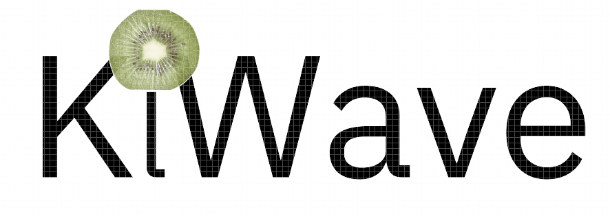

#  Sonar System

<br>


# Contents Table
[[_TOC_]]

# Information
<details><summary>Click to expand</summary>

### Team Kiwi(Group 13) 
- Kaisa Arumeel
- Alexander Säfström
- Omid Khodaparast
- Amirpooya Asadollahnejad
- Milad Tamaddondar
- János Litkei
 
[Introductory video](https://www.youtube.com/watch?v=9HAqAKBQyas) for the project:

</details>

# Project Background/ Problem Description
<details><summary>Click to expand</summary>
<br>

The need for efficient, cost-effective, and non-invasive monitoring solutions has become increasingly important in various industries. The monitoring system offers a reliable and accessible solution to security and environmental concerns. The system can be used in home security, industrial safety, parking assistance, environmental monitoring, retail analytics, and traffic management. The project builds on existing technologies and offers a customizable and expandable monitoring solution for different applications.

</details>

# Utilization
<details><summary>Click to expand</summary>
<br>

Despite the fact that the system is mainly designed for "Home Security", it has multiple other potential applications:
- Industrial safety: The system can detect objects in areas with heavy machinery and prevent accidents.
- Parking assistance: The system can detect the presence of vehicles and assist drivers in parking.
- Environmental monitoring: The system can detect changes in the environment and provide valuable insights.
- Retail analytics: The system can track the movement of customers and provide valuable data for businesses
- Traffic management: The system can detect and monitor traffic flow and help manage congestion.

</details>

# Project Description
<details><summary>Click to expand</summary>
<br>

This project aims to implement a monitoring system for a designated area or sector. The system employs two kinds of sensors: two ultrasonic sensors, a temperature sensor, and an actuator in the form of a servo motor, all of which are connected to a Wio Seeed Terminal, a microcontroller.

The core concept of the system involves mounting two ultrasonic sensors on top of a servo motor, which rotates the sensors to scan the designated area. These sensors transmit high-frequency sound waves and receive the corresponding echoes, thus detecting any objects that move within a specific radius of the sensors. The temperature sensor comes into play by measuring the temperature, which helps calculate the speed of sound in air. This information, in turn, assists in determining the amount of time in milliseconds to wait for the echo.

The servo motor is responsible for continuously monitoring its position in degrees, while the ultrasonic sensors passes the distance data it has recieved as a result of the ultrasoic wave transmission and reception to the microcontroller, the Wio Seeed Terminal, which then publishes this information over WiFi to the topic: KiWaveSonarData.

To provide a user-friendly interface, the front-end utilizes SvelteJS front-end framework and other JavaScript libraries to subscribe to the topic KiWaveSonarData. Upon receiving new information, the front-end parses and displays it in the form of a radar image that showcases the range and degree of any detected object relative to the sensors.


</details>

# Used Technologies
<details><summary>Click to expand</summary>
<br>

- C++
- JAVA SCRIPT
- FIGMA
- WIO SEEED TERMINAL 
- SERVO MOTOR
- ULTRASONIC SENSOR
- TEMPERATURE SENSOR

</details>

# Documentation 
<details><summary>Click to expand</summary>
<br>

[Documents](https://git.chalmers.se/courses/dit113/2023/group-13/kiwi/-/wikis/Home)

</details>

# Installation and "Get Started"
<details><summary>Click to expand</summary>

## Introduction
<details><summary>Click to expand</summary>
<br>

This projetct builds a sonar using one Wio Seed Terminal (which is Arduino compatibale), two ultrasonic sensors, one temperature sensor, and one servo motor. These parts make up the hardware required to build the sonar. The hardware parts are controlled using a GUI made using SvelteJs frot-end framework. The project uses the MQTT protocol (which belongs to the Publish-Subscribe Architecture style ) to connect the GUI to the Wio Seeed Terminal.

</details>

## Working with Wio Terminal and the sensors
<details><summary>Click to expand</summary>
<br>

The Wio Seeed Terminal is an Arduino Compatibale microcontroller. This means that its manipulation is done using C++ programming language. To easily upload code on the Wio Seeed Terminal, you can use the [Arduino IDE](https://www.arduino.cc/en/software). There are libraries implemented for different sensors and also for the MQTT protocol in the SonarController directory:
- `KiwiServo` library contains methods that are used to rotate the servo motor.
- `KiwiTemp` contains methods that are used to manipulate the ultrasonic sensors
- `KiwiTemp` contains methods that are used to manipulate the temperature sensor.
- `KiwiMQTT` contains method that are used to manipulate the Wio Seeed Terminal to send information over the MQTT protocol.
- Note that the `SonarController.ino` is the file containing the main code which is uploaded on the Wio Seeed Terminal. It contains the `void setup()` and the `void loop()` methods that are needed for the Wio to run.

There is a hpp file named `KiwiSecrets_template`. This file is meant to keep the WiFi name and and password. When you write your WiFi name (in the `ssd` attribute) and password (in the `secret` attribute), you should change the name of the file from KiwiSecrets_template.h to `KiwiSecrets.h`. Note that the file `KiwiSecrets.h` is put in the `.gitignore` file so that the WiFi name and password are not sent to the remote repository.

You also need to download the following libraires. You can download these by clicking on the library icon in the arduino library and search the name that are mentioned:
- `rpcwifi.h` is needed to connect to the WiFi. You can download it by searching for rpcwifi.
- `PubSubClient.h` is needed for publishing data and subscribing for data to the broker using the MQTT protocol. You can download it by searching for PubSubClient.

The following lines will explain the pin-out instructions. Use these instructions to connect the sensors to the Wio Seeed Terminal. you can use the following image for referrence to which pin is which.


Servo motor pinout structure:
- VCC connected to 4 (which is 5V) on the Wio
- GND connected to 6 (which is GND) on the Wio
- SIG connected to 16 (which is D2) on the Wio

First ultrasonic sensor pinout structure:
- GND connected to 30 (which is GND) on the Wio
- VCC connected to 1 (which is 3V3 (3.3 V)) on the Wio
- SIG connected to 36 (which is D7)non the Wio

Second ultrasoic sensor pinout structure:
- GND connected to 34 (which is GND) on the Wio
- VCC connected to 2 (which is 3v3 (3.3 v)) on the Wio
- SIG connected to 37 (which is D8) on the Wio

Temperature sensor pinout structure.
- Use the Multifunctional pinout under the joystick


</details>

## Working with the GUI
<details><summary>Click to expand</summary>
<br>

SvelteJS was used to make the GUI for this project. In order to use SvelteJS you need to have [Node.js](https://nodejs.org/en/download) downloaded.

The GUi initial setup was done by runnign the command `npm create vite@latest` in the `SonarVisualizer` directory. However, if you use our project, you do not need to run the aforementioned command, but rather the commands mentioned next.

If you fork this project and and then pull from the remote repository, before using npm commands to upload the web page, you need to open a terminal in the `SonarVisualizer` directory and run the command `npm install` or `npm i`. This command downloads the dependicies and packages that are used in the project.

The GUI can be run locally for testing or development purposes. This can be done by running `npm run dev` in the terminal while in the `SonarVisualizer` directory. After running the command, the application will be accessible at http://localhost:5173. To test the application on mobile, or other devices, it can be exposed on the local network by running `npm run dev -- --host`. Following this command the application can be accessed on the local network at the local IP address of the machine it’s running on, at port 5173. The exact address will also be displayed in the terminal.

After installing all the required dependencies, the application can be built from source by following these steps: 
1. Using the terminal, navigate to the source directory of `SonarVisualizer`.
2. Run `npm run build` to compile the Svelte files and build the project.
3. The final result can be found in the `dist` subdirectory in the `SonarVisualizer` directory. This command is mostly used in case you want to see if all the packages, especially the extra packages you have added to the project, can be run on the browser. Moreover, it is also used if you are planning to deploy your project on a server (more on this later).

If you navigate to the `src` subdirectory, you can find the different components under the `components` subdirectory. There is also a subdirectory called `data`. This directory contains the `stores.js` file which holds the information that is sent by the Wio Seeed Terminal over MQTT, and commands to be sent to the Wio Seeed Terminal by the GUI. The `App.svelte` component is the root component which contains the other components that are made under the `components` subdirectory.

Under `components` subdirectory, there is another directory called `mqtt` which conatins the `MQTTHandler.svelte` component. This component contains the publish and subscribe methods needed for the MQTT to work on the GUI.

</details>

## System Architecture
<details><summary> Click to expand </summary>
<br>

Our system, as mentioned before, made use of the MQTT protocol to create connection between the application programmed using SvelteJS and the Wio Seeed Terminal and the Sensors and actuator programmed using C++. 

What is MQTT?

MQTT is a protocol that belongs to the publish-subscribe architecture style. The publish-subscribe architecture style works in the way that different components, publish the information needed by other components to a message bus (usually called the broker) under specific topics that are defined by the developers. The components that need that data need to subscribe to the broker under the same topic that was used by the component(s) that published the information. The benefits of using the publish-subscribe architecture style is that there is little coupling between the componenets. Moreover, the components can work asynchronously as they can subcribe to the broker whenever they need, hence less coupling.

Now that the base of our system's architecture is explained, you can dig deeper into our project and see how our team made use of open source publish-subscribe libraries. Here is a component diagram that depicts the architecture of our system. Note that the broker is shown as a component, eventhough it plays the role of a connector:


As you can see in the diagram, We have two main components that communicate to each other via the broker. The App component (which is a subsystem itself), subscribes to the topic "KiwiSonarData" to receive the data that the Wio Seeed Terminal has published to the mentioned topic. The App component also publishes user's input to the KiwiSonarCommand topic. Then, the Wio Seeed Terminal subscribes to this topic and manipulates the way the sensors should work according to the user's input.

</details>

</details>

# Testing
<details><summary>Click to expand</summary>
<br>

Unit tests were made for the GUI in this project. The Jest testing framework was used to make unit tests that checked the correctness of the commands sent by the GUI and the way componenets were rendered. This section contains information regarding configuring Jest on a svelte project and the commands used to run the tests. Note that when you use `npm i` after forking our project and pulling from the remote repository, you can already use the testing commands on our project as Jest is already configured on it. The Jest configuration part is useful for those who want to configure Jest on their own projects.

## Jest configuration
<details><summary>Click to expand</summary>
<br>

Needed libraries:
1. `@babel/core`, `babel-jest` and `@babel/preset-env`are some libraires that we used. These are needed for the transpilation that is required by jest.
2. `svelte-jester` and `jest-transform-stub`. Jest does not understand how to parse non-JavaScript files. We need to use svelte-jester to transform Svelte files, and jest-transform-stub for importing non-JavaScript assets (images, CSS, etc).
3. `@testing-library/svelte` (known as Svelte Testing Library) provides DOM query functions on top of Svelte in a way that encourages better testing practices. Some of the most commonly used functions are `render`, `getByText`, `getByLabelText`, and `getByRole`.
4. `@testing-library/user-event` is a companion library to Svelte Testing Library that provides more advanced simulation of browser interactions than the built-in fireEvent function. An example of this is if you need to trigger an event for a mouse click while the Ctrl key is being pressed. You can find test examples using this library in our `test` subdirectory under `SonarVisualizer`. This library is handy for dealing with making tests for buttons.
5. If you use global environment variables or a `.env` file in your code, you need to install `babel-plugin-transform-vite-meta-env` to transform these variables for the commonJS module.
6. `@testing-library/jest-dom` provides a set of custom jest matchers that you can use to extend jest. These can be used to make your tests more declarative. It has functions such as `toBeDisabled()`, `toBeInTheDocument()`, and `toBeVisible()`.

You can install the aforementioned libraires using npm:

```
npm install -D jest babel-jest @babel/preset-env svelte-jester jest-transform-stub @testing-library/svelte @testing-library/user-event babel-plugin-transform-vite-meta-env @testing-library/jest-dom
```

We need to configure Jest to transform our files. We must explicitly set our test environment to jsdom, which we are using through Jest. Since v27 Jest’s default test environment is node, we put the configuration in a specific Jest configuration file called `jest.config.json` in the project root folder (in our case in `SonarVisualizer`):

```
{
  "transform": {
    "^.+\\.js$": "babel-jest",
    "^.+\\.svelte$": "svelte-jester",
    ".+\\.(css|styl|less|sass|scss|png|jpg|ttf|woff|woff2)$": "jest-transform-stub"
  },
  "moduleFileExtensions": ["svelte", "js"],
  "testEnvironment": "jsdom",
  "setupFilesAfterEnv": ["@testing-library/jest-dom/extend-expect"]
}
```

We configure Babel to use the current version of node. Include the `babel-plugin-transform-vite-meta-env` plugin if you are using environment variables. We put the configuration in a `.babelrc` file in the project root folder (in our case in `SonarVisualizer`). Babel is a free and open-source JavaScript transcompiler that is mainly used to convert ECMAScript 2015+ code into backwards-compatible JavaScript code that can be run by older JavaScript engines. It allows web developers to take advantage of the newest features of the language.

```
{
  "presets": [["@babel/preset-env", { "targets": { "node": "current" } }]],
  "plugins": ["babel-plugin-transform-vite-meta-env"]
}
```

Add the scripts to run the tests in your `package.json`. NOte that you should add them under the `scripts` object.

```
"test": "npx jest src",
"test:watch": "npm run test -- --watch"
```
sources: https://www.roboleary.net/2021/11/18/svelte-app-testing-jest.html

After following the instructions (in case your configuring jest on your own project), you should be able to use the command `npm run test` to run the tests that you have written for your project. Note that a test file should be name after the component that your are testing. For example, if you have a component called `Button.svelte` then the test file should be called `Button.spec.js` or `Button.test.js`. As you can see, the test file has `.spec.js` or `.test.js`. This is needed for jest to be able to find the test files which are written in JavaScript.

</details>

</details>

# CI/CD
<details><summary>Click to expand</summary>
<br>

CI/CD stands for "continuous intergration" and "continuous development". We use the GitLab piplelines to continuously test code that is committed and and then deploy the code, if it passes the tests. The pipeline is written in `.gitlab-ci.yml` file which is usually uploaded on the root of the project (good practice to put it there). As you have noticed by now, this is a YAML file which contains commands that are executed by the GitLab runner(s). GitLab runners are computers that have Linux as their Operating System. These runners pull your project and look for the CI file and run the commands that you have given there. To install packages and programs on the runner to run your commands, most projects (our project too) use docker images. You can find docker images for the applications (programs) that you need in order to test and/or deploy your project from [docker hub](https://hub.docker.com/). Each block of commands that is executed by the GitLab runner is called a job. Note that you need to use a runner that can handle docker images. You can see the available runners under CI/CD in settings. You can see the result of your pipline under the CI/CD Pipelines.

You can customize your `.gitlab-ci.yml` file in many ways:
- You can add stages, so that if one stage fails the reat do not run (useful in case of deployment). For example, if your test job fails, you do not want to deploy your project.
- You can customize your jobs by using the `rules` flag, so that your job runs only on specific branches (in case of deployment, in `main` branch only as an example). 
- You can add the `before-script` to download dependencies needed by the commands that run in the `script` flag.
- You can specify the runner on which each job needs to run on using the `tags` flag.
- Note that the jobs need to have the `script` flag. A job without the `script` flag does not do anything, so it will always pass.

This is just a glimpse into what you can do using CI/CD in GitLab. Our project uses CI/CD for automated testing and deployment. It is a simple pipeline. You can use this as a starting point. You can read and learn more about the sophisticated and advanced features of GitLab CI/CD [here](https://docs.gitlab.com/ee/ci/).

</details>

# Team Members' Main Contributions
<details><summary> Click to expand </summary>
<br>

Kaisa Arumeel:
- Organised our GitLab repository by making milestones, labels and issues. Continuously updating our repository and keeping track of the issues.
- Created the front-end design prototype, project name and logo.
- Implemented the range slider and the sector specification slider features.
- Designed and implemented the loading scene.
- Implemented dark mode (including the dark mode switch and the colour scheme for the theme).
- Resposible for putting the whole front-end layout together and making it responsive.
- Edited the wiki pages and user manual.

Alexander Säfström:
- Implemented MQTT library to Wio Terminal
- Added MQTT library to frontend.
- Ported `u8-mqtt.js` to vite.
- Created `TrackMode.svelte`
- Helped solving bugs
- Developed algorithm for tracking objects in Wio Terminal
- Created `MqttHandler.svelte`
- Created main logic for periodically updating `stores.js`

Omid Khodaparast:
- Implemented the initaial KiwiServo library which is used to rotate the servo motor and tell it when to stop. This library, later in the project, went under some changes as Alexander Säfström started working on implementing the KiwiMQTT library.
- Implemented the KiwiTemp library which contains functionality used to receive the temperature measured by the temperature sensor.
- Implementedthe loading scen for the `ScanButton.svelte`component which showcases to the end user when the start and stop commands have been received by the sonar (the Wio Seed Terminal).
- Configured Jest (used to make unit tests) in the `SonarVisualizer` directory, which contains the main application used by the end users to manipulate the sonar. 
- Configured the CI/CD part of the project by creating the `.gitlab-ci.yml` and editing it by giving it different stages and different jobs to complete the Automated testing and continous deployment of the project.
- Edtited and gave structure to the `README.md` file.

Amirpooya Asadollahnejad:

Milad Tamaddondar:

János Litkei:
- Created the 3D model for the 3D printed mount to fix the ultrasonic sensors on the servo. In the final product we ended up not using it.
- Implemented the RadarScreen component of the frontend, which interprets and visualises the data received from the sensors.
    - Created the methods for processing the data received from the sensors.
    - Implemented the visualisation of the data.
    - Made the RadarScreen component responsive.
    - Implemented tooltips showing object-meausrement data on the RadarScreen component.
- Set up private MQTT broker for better reliability.
- Worked on the deployment of the frontend on a VPS, as part of the CI/CD pipelines.
- Edited the user manual.

</details>


